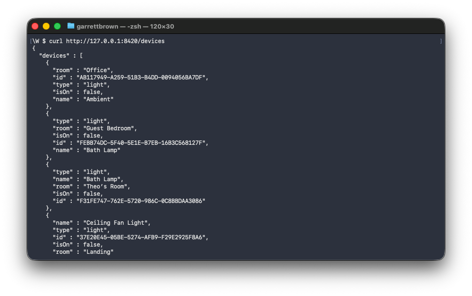
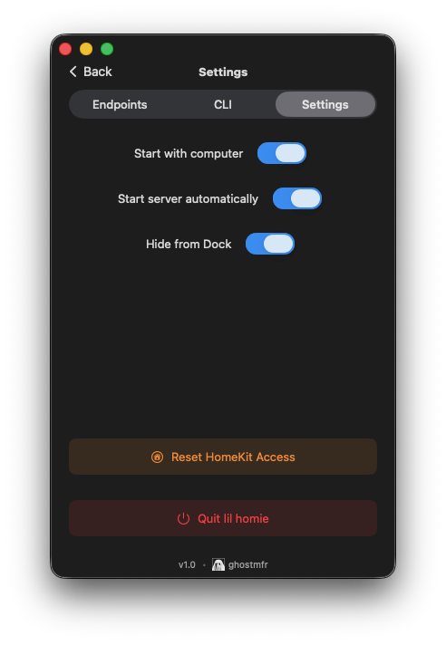
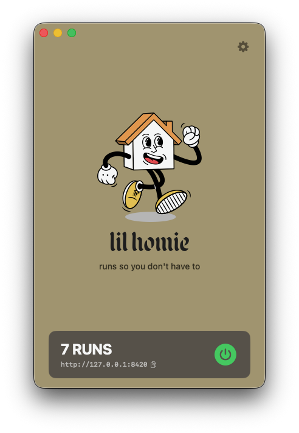

<p align="center">
  
</p>

<h1 align="center">lilhomie</h1>

<p align="center">
  <strong>HomeKit REST API + CLI for macOS</strong>
</p>

<p align="center">
  
  
  
</p>

---

I built **lilhomie** so my AI assistant could control my house. Now you can too.

It's a **macOS app** that runs a local REST API for your HomeKit devices. The CLI talks to the app. No hacks, no workarounds — just Apple's native HomeKit framework exposed over HTTP.

### How it works

```
┌─────────────────┐      ┌─────────────────┐      ┌─────────────────┐
│  lilhomie CLI   │ ───► │  lilhomie.app   │ ───► │    HomeKit      │
│  (or any HTTP)  │      │  (REST server)  │      │   (Apple API)   │
└─────────────────┘      └─────────────────┘      └─────────────────┘
```

- 🖥️ **macOS app** runs the server on `localhost:8420`
- ⌨️ **CLI** sends requests to the app
- 🏠 **100% Apple HomeKit** — no reverse engineering, no cloud APIs
- 🔒 **Local only** — never touches the internet (unless you're an idiot)
- 🚀 **Raycast extension** — coming soon

### Screenshots

<p align="center">
  
  
  
</p>

---

## Installation

### Download

Grab the latest release:

👉 **[Download lilhomie](https://github.com/ghostmfr/lilhomie/releases/latest)**

- `lil-homie-v1.0-mac.zip` — macOS app
- `lilhomie-cli-v1.0.zip` — CLI binary

### Setup

1. Unzip and drag **lilhomie.app** to Applications
2. Launch and grant HomeKit access when prompted
3. Server starts automatically on port 8420

### CLI Installation

```bash
# Download and install
curl -L https://github.com/ghostmfr/lilhomie/releases/latest/download/lilhomie-cli.zip -o lilhomie.zip
unzip lilhomie.zip
sudo mv lilhomie /usr/local/bin/
```

### Shell Completions

Completion scripts for **bash**, **zsh**, and **fish** are included in the
`completions/` directory of this repository. After installing the binary, set
up completions for your shell:

#### zsh

```bash
# Option A — copy to a fpath directory (recommended)
sudo cp completions/lilhomie.zsh /usr/local/share/zsh/site-functions/_lilhomie

# Option B — add completions dir to fpath in ~/.zshrc
mkdir -p ~/.config/lilhomie/completions
cp completions/lilhomie.zsh ~/.config/lilhomie/completions/
echo 'fpath=(~/.config/lilhomie/completions $fpath)' >> ~/.zshrc
echo 'autoload -Uz compinit && compinit' >> ~/.zshrc

# Option C — Oh-My-Zsh
cp completions/lilhomie.zsh ~/.oh-my-zsh/completions/_lilhomie
```

#### bash

```bash
# Option A — bash-completion framework
sudo cp completions/lilhomie.bash /etc/bash_completion.d/lilhomie

# Option B — source directly from ~/.bashrc
mkdir -p ~/.config/lilhomie/completions
cp completions/lilhomie.bash ~/.config/lilhomie/completions/
echo 'source ~/.config/lilhomie/completions/lilhomie.bash' >> ~/.bashrc
```

#### fish

```bash
# User completions directory (no sudo required)
cp completions/lilhomie.fish ~/.config/fish/completions/lilhomie.fish

# Or system-wide
sudo cp completions/lilhomie.fish /usr/share/fish/vendor_completions.d/lilhomie.fish
```

Then restart your shell (or run `exec $SHELL`) and tab-completion for
`lilhomie` will be available.

---

## REST API

The API runs on `http://localhost:8420` while the app is running.

> **Tip:** Use underscores for spaces in device/room names: `Desk_Lamp`

### Devices

```bash
# List all devices
curl localhost:8420/devices

# Get device info
curl localhost:8420/device/Desk_Lamp

# Toggle
curl -X POST localhost:8420/device/Desk_Lamp/toggle

# Explicit on/off
curl -X POST localhost:8420/device/Desk_Lamp/on
curl -X POST localhost:8420/device/Desk_Lamp/off

# Set brightness
curl -X POST localhost:8420/device/Desk_Lamp/set \
  -H "Content-Type: application/json" \
  -d '{"brightness": 50}'
```

### Rooms

```bash
# List rooms
curl localhost:8420/rooms

# All devices in room
curl localhost:8420/room/Office

# Room on/off
curl -X POST localhost:8420/room/Office/on
curl -X POST localhost:8420/room/Office/off

# Room-scoped device on/off
curl -X POST localhost:8420/room/Office/device/Desk_Lamp/on
curl -X POST localhost:8420/room/Office/device/Desk_Lamp/off
```

### Scenes

```bash
# List scenes
curl localhost:8420/scenes

# Trigger scene
curl -X POST localhost:8420/scene/Good_Night/trigger
```

---

## CLI

```bash
lilhomie list                    # List all devices
lilhomie status "Desk Lamp"      # Device status
lilhomie on "Desk Lamp"          # Turn on
lilhomie off "Desk Lamp"         # Turn off
lilhomie toggle "Desk Lamp"      # Toggle
lilhomie set "Desk Lamp" 50      # Set brightness to 50%

lilhomie scenes                  # List scenes
lilhomie scene "Good Night"      # Trigger scene

lilhomie info                    # Show Homie app status
```

### JSON output flag

Add `--json` (or `-j`) to any command to get raw JSON back instead of the
human-readable output. Perfect for piping into `jq` or any other tool.

```bash
# List all devices as JSON
lilhomie list --json

# Filter to devices that are currently on
lilhomie list --json | jq '.devices[] | select(.isOn) | .name'

# Get a single device as JSON
lilhomie status "Desk Lamp" --json

# Check scenes as JSON
lilhomie scenes -j | jq '.scenes[].name'

# Use in scripts
IS_ON=$(lilhomie status "Desk Lamp" --json | jq -r '.isOn')
```

---

## Use Cases

- **Home automation scripts** — bash, Python, Node.js
- **Stream Deck buttons** — trigger via curl
- **Clawdbot** — quick device control via imessage
- **Webhooks** — IFTTT, n8n, Home Assistant
- **Cron jobs** — scheduled lighting
- **SSH** — control home from anywhere

---

## Requirements

- macOS 13.0 (Ventura) or later
- Apple Developer account (for HomeKit entitlement)
- HomeKit-compatible devices

---

## Building from Source

```bash
git clone https://github.com/ghostmfr/lilhomie.git
cd lilhomie
open Homie.xcodeproj
# Build and run in Xcode
```

---

## Known Issues

See [Issues](https://github.com/ghostmfr/lilhomie/issues) for current bugs.

---

## License

MIT — see [LICENSE](LICENSE)

---

<p align="center">
  Made because siri sucks at turning off my lights.<br>
  <a href="https://github.com/ghostmfr">Ghost Manufacture</a>
</p>
